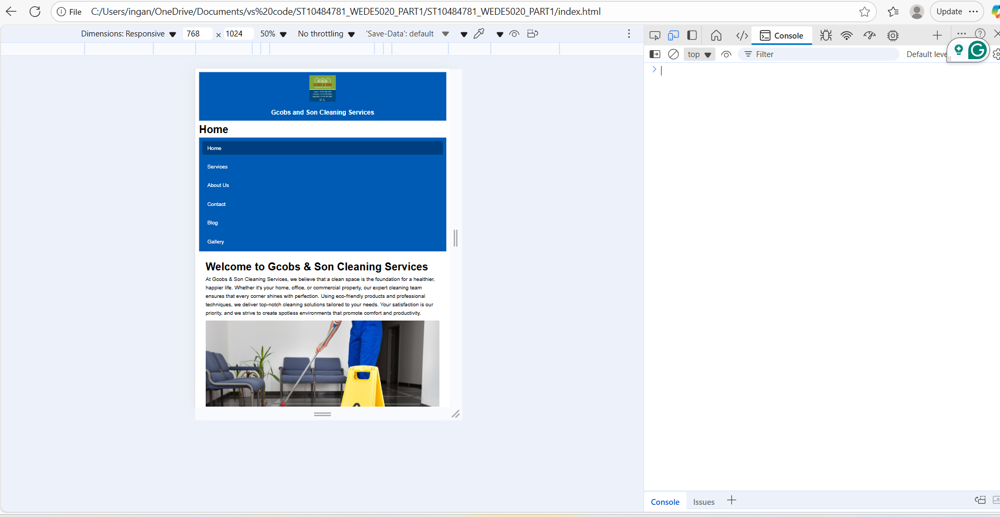
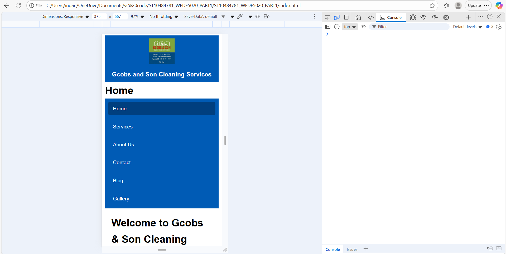

# ST10484781_WEDE5020_PART1
## Overview
Designing the cleaning service website was a step-by-step affair, beginning with a proposal articulating the need for a professional website to advertise services, become credible, and acquire customers. In the planning stage, the focus was on developing a clean and professional look with HTML as the structure and CSS as the style to make it a clean and modern look that responds. The website had primary pages that included a homepage, services, about, contact, and blog, all with specific functions of showcasing offerings, providing company background, facilitating communication, and providing cleaning tips to establish expertise. The website used neutral colors, rounded corners, and minimalistic elements to convey professionalism and trust. Issues such as inconsistent filenames and problems with homepages loading were solved during implementation through standardized filenames and navigation links. The final result is a working, nice-looking site that conveys the business's identity, highlights its services, and involves clients through content accessibility and interactivity.

## Screenshots
Screenshots of the website tested on different devices and screen sizes:

### Desktop View

### Tablet View

### Mobile View

## Changelog
This section records all changes made after Part 1 feedback.

#### Added
- Created external stylesheet style.css and moved it to a separate css folder.
- Linked all HTML pages to the external CSS.
- Added responsive design with breakpoints for tablet and mobile views.
- Styled navigation menu with hover effects.
- Added form styling and gallery grid layout.

#### Changed
- Improved folder structure for better organization.
- Updated all link tags to use the correct css/style.css path.
- Replaced inline styles with modern external CSS rules.

#### Fixed
- Corrected image paths to ensure all images load correctly.
- Fixed layout issues for smaller mobile screens.

---

REFERENCES

Brown, T. (2020) The role of online presence in small business growth. Cape Town: SA Business Press.

Chaffey, D. and Ellis-Chadwick, F. (2019) Digital Marketing: Strategy, Implementation and Practice. 7th edn. Harlow: Pearson.

Jones, M. (2022) Digital marketing strategies for service-based businesses. Johannesburg: BizTech Publications.

Smith, R. (2021) ‘How consumers find and choose local businesses’, Journal of Digital Commerce, 14(3), pp. 45–52.

## Author
- **Name:** Inganathi Mancam  
- **Student Number:** ST10484781  
- **Module Code:** WEDE5020  
- **Lecturer:** Ms Phewa  

